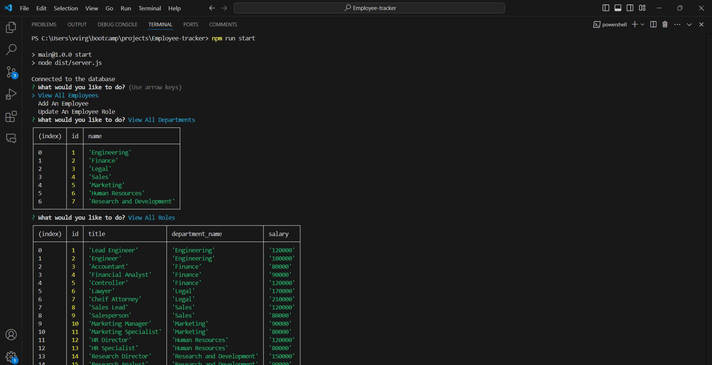
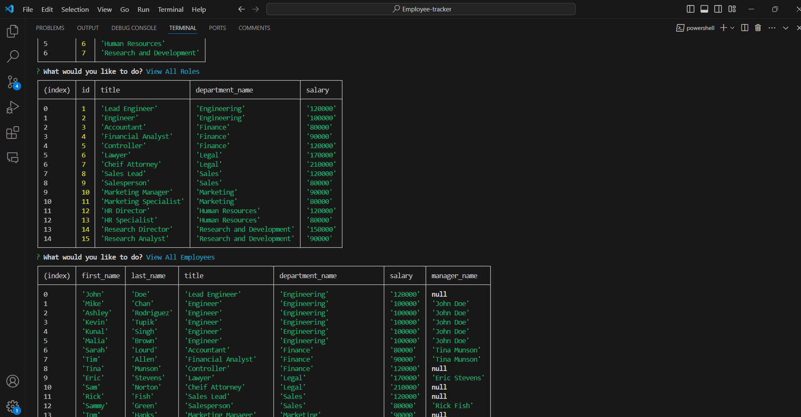
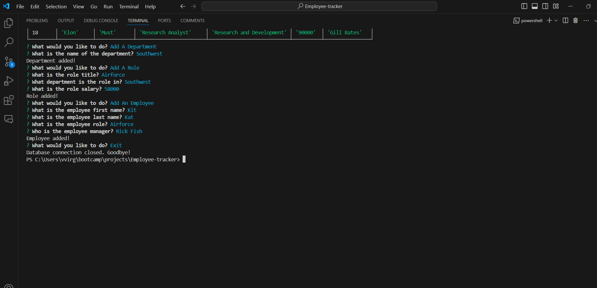

# Employee-tracker

## Basic Overview
In this command-line application, the user (you the business owner), can quickly and easily create and manage employees' data. This allows you to have more details on employees' roles, salary and what department they fell under.

## The Application

The application uses a command-line that dynamically manages your employee data files using Postgres SQL from a user's input while using the Inquirer package. 

The application will be invoked by using the following command:

    node index.js
    inquirer package
    pg package

The application will ask questions that reflects the general outline of the employee role int he company. The Employee Tracker app can also update an employy role in the company. 

## Walkthrough

The link below will guide you how to use the Employee Tracker
### Video Walkthrough
 ||
[Google drive video alternative](https://drive.google.com/file/d/1_KOifXqcqdsQuHyn0_oLFeWnDBxYd460/view?usp=sharing)

## Screenshot
The following images demonstrates the application's appearance and functionality:
### Questions

### Result

© 2024 lenworth425 Confidential and Proprietary. All Rights Reserved.